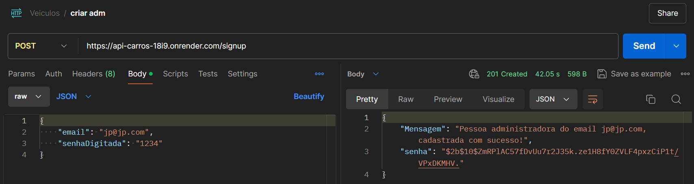
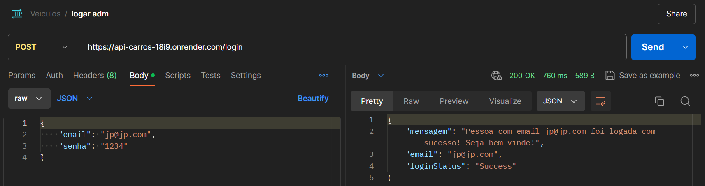
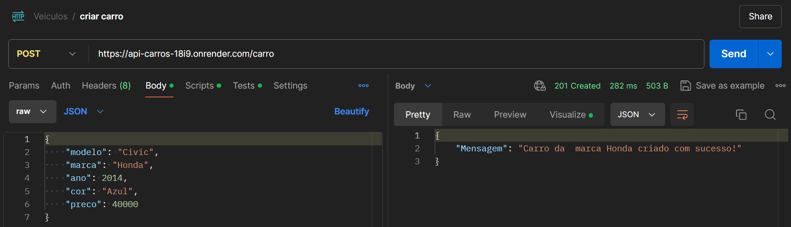
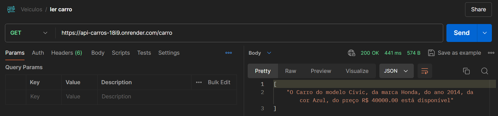
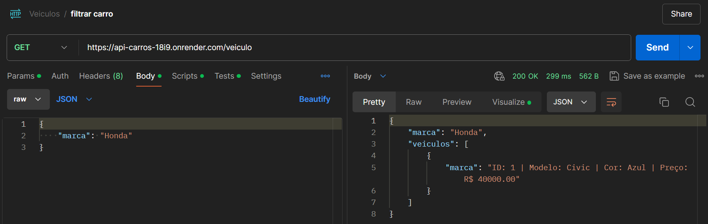
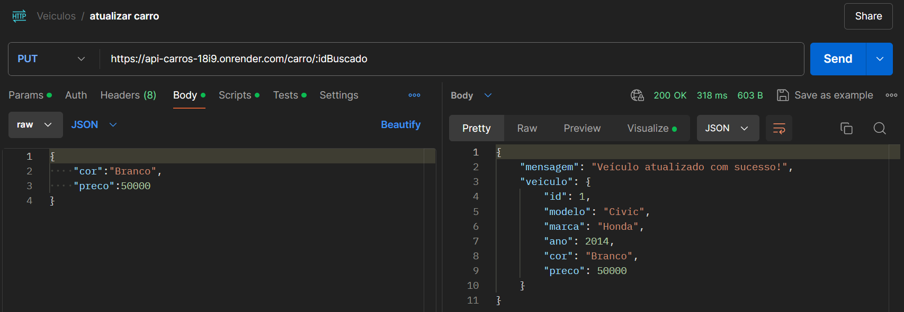
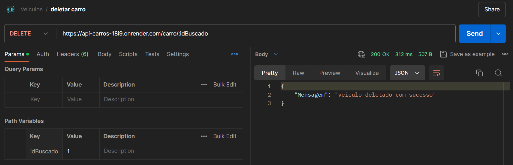

# API_Carros
 
Esta API é uma aplicação backend que gerencia registros de carros e autenticação de usuários. Aqui está um resumo do que ela faz:

- Cadastro e Autenticação de Usuários:

Cadastro (/signup): Permite que uma nova pessoa se cadastre como administradora. O endpoint espera um email e uma senha, verifica se o email já está cadastrado e, em seguida, armazena as informações com a senha criptografada.

Login (/login): Permite que uma pessoa cadastrada faça login usando seu email e senha. Se a combinação de email e senha estiver correta, ela é autenticada com sucesso.

- Gerenciamento de Carros:

Criação de Carro (/carro): Permite criar um novo carro com informações como modelo, marca, ano, cor e preço. O endpoint verifica se todos os dados necessários são fornecidos e se estão corretos.

Listagem de Carros (/carro): Retorna uma lista de todos os carros cadastrados. Se não houver carros, retorna uma mensagem informando que não há carros cadastrados.

Filtragem de Carros por Marca (/veiculo): Filtra os carros pelo atributo "marca". Se uma marca é fornecida, ele retorna uma lista de carros dessa marca. Se não encontrar nenhum carro para a marca informada, retorna uma mensagem apropriada.

Atualização de Carro (/carro/:idBuscado): Atualiza um carro específico com base no ID fornecido. Permite modificar a cor e o preço do carro. Se o ID não for válido ou não encontrar o carro, retorna uma mensagem de erro.

Remoção de Carro (/carro/:idBuscado): Remove um carro específico com base no ID fornecido. Se o ID não for válido ou o carro não for encontrado, retorna uma mensagem de erro.

- Mensagens de Erro e Segurança:

Todos os endpoints possuem validações básicas para garantir que os dados fornecidos sejam válidos.

A aplicação lida com erros internos de servidor e fornece mensagens de erro apropriadas quando algo dá errado.

Em resumo, esta API oferece recursos para gerenciamento de carros, com funcionalidades para criar, ler, atualizar e excluir carros, além de recursos para cadastro e autenticação de administradores.

<a href="https://documenter.getpostman.com/view/34269147/2sA3Bt3puM">
Para acessar a documentação da API clique aqui
</a>

### Técnologias usadas na API:

  
  
  
  
  

  
  
  
  
  

  

